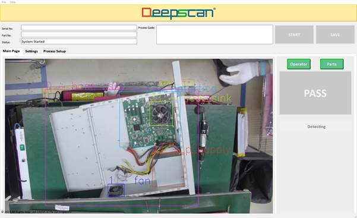

### 1.0 Install AI Inspector software;
Install from the provided package. AI Inspector currently support Windows 10 or 11 only.

``` bash 
copy deep-scan installation folder to c:\deep-scan
```

### 1.1 Setup the camera
Connect the camera to the computer using the Ethernet cable from the camera to the supported Windows computer.
If the PoE function is used, an Ethernet switch with PoE support is required.
The user may alternatively use Ethernet connection without PoE, however the user needs to power the camera with the supplied power adapter. 
<br/>
USB connection is not preferred as it lowers the video resolution to the computer.

<br/>
Power up the camera and let its self-initialisation, which lasts about 30 seconds.

<br/>

## 1.2 Start AI Inspector
Double click the exe file to start running the software
``` bash 
c:\deep-scan.exe
```
Click on "START" button to begin running the inspection operation.
### NOTE:
Click "START" only after the camera self-initialisation has completed, which is indicated by the red LED on the front of the camera. 

<br/>

Upon starting the AI Inspector you will see the following user interface display.
The video feed from the camera will appear in the interface.

### User Interface



