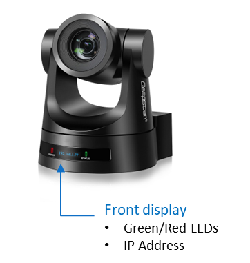
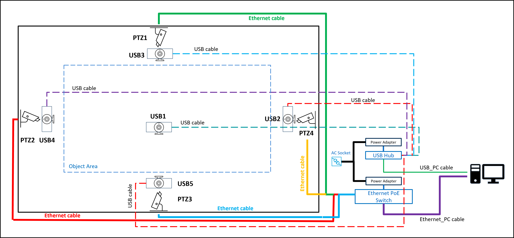
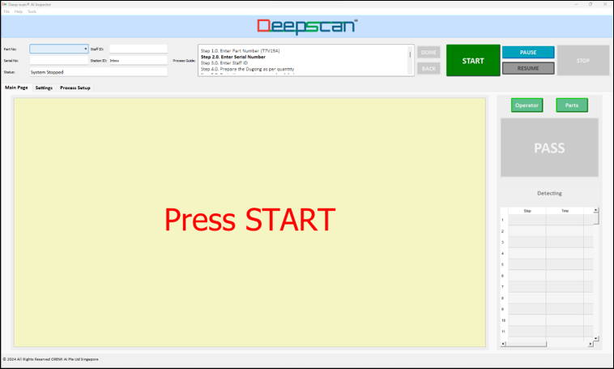

#**Installation**

## **A. Install AI Inspector software**
Install from the provided package. AI Inspector currently support Windows 10 or 11 only.

``` bash 
copy deep-scan installation folder to c:\deep-scan
```
<br/>

## **B. Hardware Setup**
### PTZ Camera<br/>
1. Connect the PTZ camera to the computer using the Ethernet cable from the camera to the supported Windows computer.<br/>
2. If the PoE function is used, an Ethernet switch with PoE support is required.<br/>
3. The user may alternatively use Ethernet connection without PoE, however the user needs to power the camera with the supplied power adapter.<br/>
4. For PTZ cameras use Ethernet instead of USB connection for better video resolution to the computer.<br/>
5. The camera's front LED display shows the IP address, use link this address to the system in the "App.conf" configuration file. You may change the IP address of the camera inside the camera webpage using this IP address.<br/>
6. The Green LED on the camera's front blinks during self-initialization upon power up. The duration of self-initialization is about 30 seconds.<br/>
7. The Red LED is ON indicates the camera is ready for operation.<br/>
8. Deep-scan&reg; re-initializes the camera(s) for each "STOP" button operation, and auto-detects the camera readiness (Red LED) before enabling the software's "START" button.<br/>
<br/>
*PTZ Camera Details*: <br/>

<br/>

### USB Camera<br/>
1. Connect the USB camera to the computer directly to the PC.<br/>
2. If there are insufficient USB ports on the computer, connect to the PC through a powered USB hub.<br/>

### Cabling Components<br/>
1. ***Ethernet cables***: <br/>
a. >= Cat 6A<br/>
2. ***USB cables***: <br/>
a. USB3.0 with Boosters<br/>
3. ***Ethernet Switch***: <br/>
a. Example: TP-Link TL-SG105PE<br/>
4. ***USB Powered Hub***: <br/>
a. Example: TP-Link UH700<br/>
<br/>
<br/>
*Hardware Schematics*: <br/>

<br/>
<br/>


## **C. Start AI Inspector**
Double click the exe file to start running the software
``` bash 
c:\deep-scan.exe
```
<br/>

Click on "START" button to begin running the inspection operation.
<br/>

#### Note:
Click "START" only after the camera self-initialisation has completed, which is indicated by the red LED on the front of the camera. 
<br/>
<br/>


## **D. User Interface**
Upon starting the AI Inspector you will see the following user interface display.
The video feed from the camera will appear in the interface.
<br/>
<br/>
*User Interface*: <br/>


<br/>
<br/>

