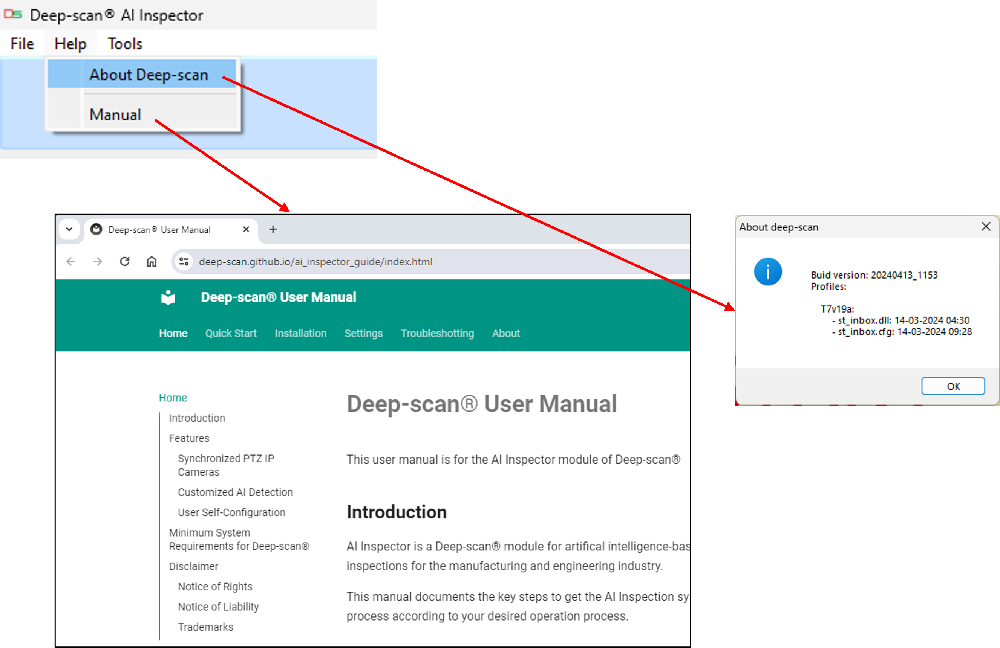
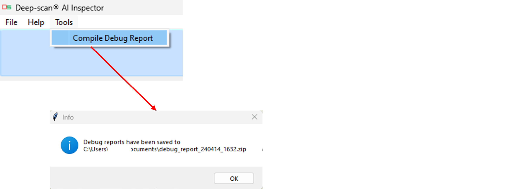
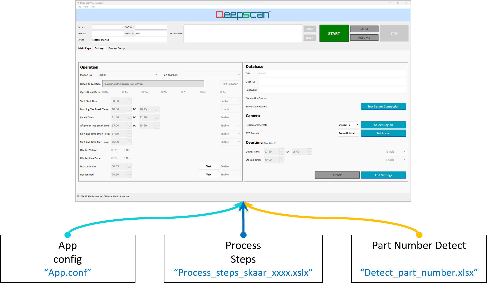
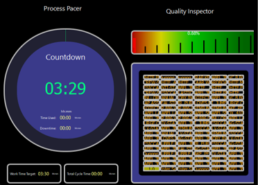

# **Quick Start**

## **One-Time System Setup**
1. Install Deep-scan&reg; AI Inspector software.
2. Setup the camera(s) by connecting the PoE cable to the computer or power plus Ethernet cable.
3. Setup the inspection or work process steps. 
4. Link the cameras to the process in the configuration file.
5. Setup the AI modules in the configuration file.
6. Run Deep-scan&reg; AI Inspection software.
7. Go to "Settings" tab to setup the Product Part Numbers, Data Folder, Work schedule, Database setup and camera zone setup. 

## **Start using AI Inspector**
1. Run Deep-scan&reg; AI Inspection software. 
2. Click on "START" button on the Main tab. 
3. Follow the process steps as automatically indicated on the user interface.
4. The voice and text prompts will guide the user throughout the processs.
5. Upon completing the process, "PASS" button will light up, click "STOP" to end the process.
6. The data will be saved into the data folder.
7. The camera will self-calibrate upon clicking "STOP". 
The camera calinbration process lasts approximately 30secs, during which a pop-up message will indicate the ongoing process. Once calibration process is completed, the pop-up message goes off automatically and the "START" button is re-enabled.

## **Main Page**
### Navigating the Main Page tab 
1. **START** 
2. **STOP** 
3. **PAUSE/RESUME**: Ad-hoc Pause and Resume for cycle time records. Auto-pause/resume is operational following the work schedule under Settings Tab. 
4. **DONE/BACK**: Click Done to skip the step, if Skip is configured as “Y”. 
5. **Process Guide**: Guide auto-scroll 1-line description. 
6. **STATUS**: Current Status, Report Location 
7. **Detection Table**: Detection and Data results. Scroll to the right for data details. 
8. **Tabs**: Main Page/Settings/Process Setup. Click on Settings, then enter the provided password to enter the Settings Page. 
9. **Parts**: Display All or recent steps’ parts detections.  
10. **Operator**: Display Y/N the operators’ detections. 
11. **PASS/FAIL**: Result of the process.  
12. **Video Feed**: Shows the video feed from the current step’s camera. 
 
*Main Page*:  

 
 

 
 

## **Menu**
1. **User Manual**: provides Operations and FAQs, internet access is required. 
2. **Compile Debug Report**: to send the log files along with your issue descriptions to Oremi for technical support. 
 
*Menu*:  

 
 

 

## **Settings**
### Navigating the Settings tab 
1. ***Operation*** 
a. Data file location - Excel sheet output data including detection time-stamp, cycle time, barcodes and QR codes. 
b. Part number’s list as configured in App.conf. 
c. Operation schedule – self pause and resume over breaks and days (multi-day operations). 
2. ***Database*** 
a. Settings for uploads to on-premise sql database. 
3. ***Camera*** 
a. AOI crop – select camera then click AOI region in video feed pop-up, click top left corner then drag to bottom right corner which will auto save the AOI. 
b. PTZ zone preset – select PTZ zone, then in the video feed pop-up, left click and drag for pan-tilt, and mouse wheel for zoom. Click “Set Preset” again to save. 
4. ***Overtime*** 
a. Set up auto-pause/resume schedule for overtime. 
 
*Settings*:  

 
 

## **Configuration Setup**
1. ***Configuration files**
a. All configurations files are contained within the “conf” sub-directory. 
2. ***App.conf*** 
a. General settings such as displays, dashboard, sound, camera addresses, resolutions etc 
b. Product specific settings such as to link the product part numbers to the machine learning profiles and process steps, camera zones, detection classes. 
3. ***Process Steps*** 
a. Product specific process, detection flows and actions. 
4. ***Part Number Detect*** 
a. General product model detection. 
 
*Configuration structure*:  

 
 

## **Display Windows**
1. Individual windows for each camera’s video feed 
a. Video feeds in extended display windows for > 2 cameras setup. For single camera setup the video feed is within the Main Page only. 
b. Size / location configurable. 
2. Visual dashboard 
a. Real time status. 
b. Widget On/Off configurable. 
c. Status cells auto-configured based on process setup. 
d. Work time target setup in App.conf. 
 
*Dashboard window*:  

 
 

