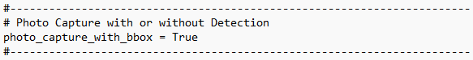
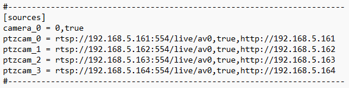
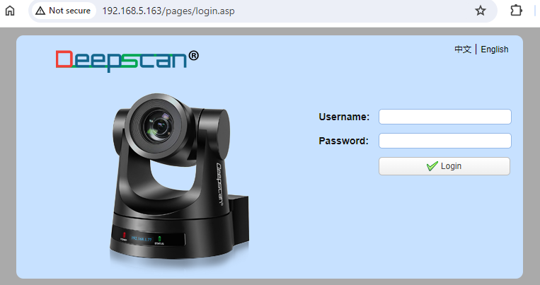
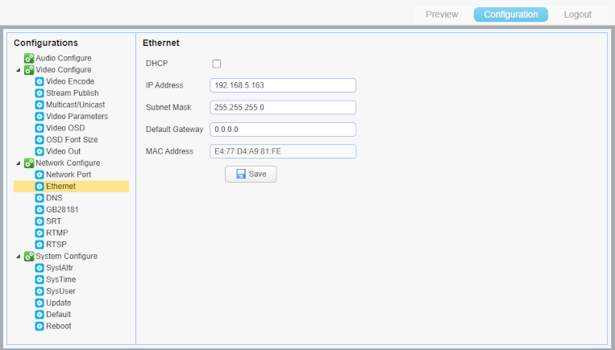
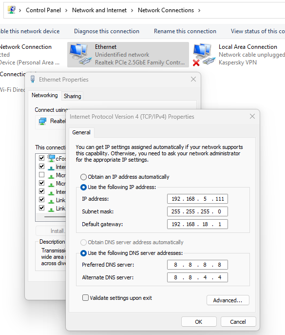
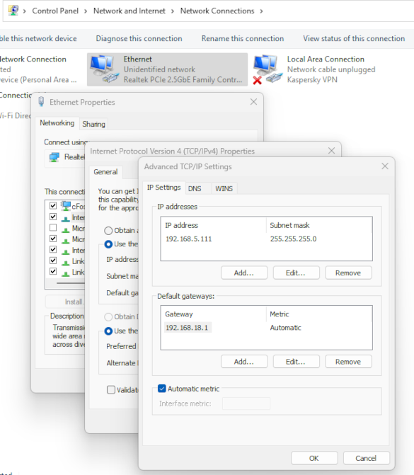

#**Settings**

The following settings enables the user to configure the process flow, link the cameras and view angles, setup the machine learning detections for the entire process.
The user has full control over how the system flows and captures the data over the entire process.
  
 

There are 4 sets of configuration settings - 3 of which are in the "conf" folder and 1 within Deep-scan&reg; :
 
A. App Configuration
 
B. Deep-scan&reg; Settings Tab
 
C. Mandatory Process Steps
 
D. Process Steps
 
 

## **A. App Configuration**
In this configuration, the user sets up the process names, part names and links the AI modules to the process step files from the above steps.
 
Open the App.conf file under the Conf Directory.
 
 

### **1. mandatory_process_file**
Enter the directory and filename to match the filename for your Mandatory Process Step file.
 
Mandatory process file link - example:
 

 
 

### **2. profile**
Enter the profile name of your process in small caps single string. This will be displayed in the User Interface as reference for the assembly Station ID during software operation.
 
Overall profile name of the process - example:
 

 
 

### **3. stations**
The name on the left of “=” needs to match the profile name. The names of the config files after the “=” needs to match the filenames provided to the user during the system purchase.
 
Station name of the process - example:
 

 
 

### **4. ptzcam zones**
Setup the names for the zones in any alpha numeric string, as in the example below, but the names must be unique and the number indentifier after “=” must be unique.
 
PTZ camera zones - example:
 

 
 

### **5. photo_capture_with_bbox**
Setup the process photo capture option with either the detection box Yes or No.
 
Photo Capture with detection box - example:
 

 
 

### **6. camera sources**
Setup the cameras for the system to recognise and connect to. 
USB cameras - use "camera_n" header. 
PTZ cameras - use "ptzcam_n" header.  
"n" is a running number for the user to decide. 
USB cameras are UVC compliant, and PTZ cameras are IP protocol cameras.  
Use the following example as a guide to setup. The IP address must match the PTZ camera's address in the camera's webpage.  
Sources - example:
 

 
 

### **7. PTZ camera IP address**
Setup each PTZ with a unique IP address. The system uses these unique IP addresses to retrieve the video feed and to control the camera's PTZ actions. 
a. Connect the IP camera directly to the computer's Ethernet port, or through the PoE switch. 
b. Turn ON that particular PTZ camera you wish to setup the IP address, and turn OFF all other PTZ cameras in the system. 
c. Check the current IP address of the camera from its front LED display. 
d. Key in the IP address from the cammera's display onto any web browser. Enter the username and password provided by Oremi at the login page as follows: 
 

 
 
e. Click on "Configuration" tab, see picture below, under "Network Configure" click on "Ethernet". 
f. Change the last digit of the "IP Address" to your desired value. 
g. Click on "Save" button. 
h. Logout, then power cycle the camera to enable the new IP Address. 
i. Confirm the IP Address change fron the font LED display of the camera after power cycle. 
 

 
 

### **8. Ethernet settings in Windows**
Assign IP settings for the PTZ cameras. 
a. Type "Control Panel" in Window's "Search" cell beside Window's "Start" button, then click on "Control Panel System" icon 
b. Click on "Network and Sharing Center". 
c. Click on "Change adapter settings". 
d. Double-click on "Ethernet", then click on "Properties" button. 
e. Select "Internet Protocol Version 4(TCP/IPv4), then click on "Properties" button. 
f. Select "Use the following IP address, change the settings to the example below. 
 

 
 
 
g. Now click on "Advanced..." button. 
h. Set the IP address and Gateway using the following picture as a guide. 
i. Click on "OK", and "OK", and "OK", and "Close" buttons. This closes all Ethernet settings related windows and saves its related settings. 
 

 
 

## **B. Deep-scan&reg; Setting**
The Settings tab under the Deep-scan&reg; user interface sets up the Work schedule, Data folder, Database transfer protocol and the cameras' crop, PTZ views. 
 

### **1. Deep-scan&reg; Settings Tab**

 
 

### **2. Run Deep-scan&reg; AI Inspection software**
Click on the **Settings** tab on the User Interface. 
Enter the password, which is provided to you during the software purchase.

### **3. Operation**
Set up the Work schedule, Data folder, Database Protocol under this section.
 
Click on the **Edit Settings** to edit. 
 
**Station ID**: Click on the drop down list to select.
 
**Part Number**: Optional - click on the drop down list to select.
 
The settings for the rest of the items are intuitive and easy to use.
When completed click on the **Submit** button.
 

### **4. Database (Add-on Module)**
Enter the DSN, UserUD, Password.
 
Click on Test Server Connection to check the Connection Status.
 

### **5. Camera Settings**
Click on the drop down list of the camera to select one of the cameras.
 

**5.1 Crop**:
This is for fixed FOV cameras only as it is unneccesary fpr PTZ cameras. Click on the **Select Region** button, which will bring up the video feed from the camera in a separate window.
 
Left click-&-hold the mouse onto the left-top of the crop area in the video feed window, drag the mouse to the bottom-right of the crop area and release. This will set the crop area of the video feed to the system. Do the same for each camera you wish to crop. 
 

**5.2 PTZ Presets**:
First select the camera from the Camera drop down list.
 
Then click on the Zone drop down list to select the PTZ zone to set.
 
Click on **Set Preset**, this will bring up the video feed from the PTZ camera with the previously saved camera view angles and zoom.
 
Left click-&-hold the mouse, drag the mouse in any X Y direction to position left-right the camera angle, then left go of the mouse button.
 
Scroll the mouse wheel to zoom in-out the camera zoom level.
 
The camera is on auto-focus at all times.
 

**Save PTZ Zone**: Click **Set Preset** to Save the PTZ zone.
 
Repeat the above process for all cameras.
 
Re-start Deep-scan&reg;.
 
 

## **C. Mandatory Process Step**
Open the Mandatory Process step file, see the picture below. 
Fill up just 1 row for the overal process part number. The process is the same as with the Process Steps Settings. 
 
Mandatory process step - example:
 

 
 

## **D. Process Steps**
These settings configure the process flow for the AI Inspector and link the camera sources, camera PTZ zones and various action items to each of the process steps.
 
Open the Process Steps file under the Conf directory.
 
 
Process step settings file - example:
 

 
 
Fill up the key process columns in the sheet, as shown in the example below.
 
 

### **1. Detection Classes**
Enter according to the classes provided for each of your parts from the machine learning process. 
 

### **2. Step Number**
This may be in single or multiple decimal points, but it must be unique and prefereably in running order for useful reference. 
 

### **3. Part Name**
This is the component's part name related to the particular process step, it is for the user's internal reference use. 
 

### **4. Part Number**
This is the component's part number related to the particular process step, it is for the user's internal reference use. 
 

### **5. Qty**
This needs to be filled in according to your process. AI Inspector will count it. 
 

### **6. Process Description**
Enter according to your process, but keep it succint for better visibility. 
 

### **7. Allow Skip (Y/N)**
Enter according to your process requirements. 
a. If SKIP = **Y**: Step will be allowed to Skip after "Duration" or upon clicking "DONE". 
b. If SKIP = **N**: Skip Step is not allowed, and user must show correct process to the system. 
c. "BACK" button option *only* appears each time a Step is Skipped. 
 

### **8. Zone**
This is the PTZ camera zone to set the camera viewpoint. The zone may be shared with any process step or specific to the process step. The name may be of any alpha numberic format, so long as it matches the zone name in the App.conf file. 
 

### **9. Generate Voice**
Y/N to read the Process Description. 
 

### **10. Source**
Enter the camera ID. This links the cameras to each process steps in the process file. 
 

### **11. Profile**
Enter the profile option - "part", "barcode", "qrcode", "face", "ocr". Availability depends on your module purchase. 
 

### **12. Data Format**
Authentication format of your barcode, QR code or OCR. You may leave it empty if you wish. 
 

### **13. Sequential**
Y/N for the process step. 
 

### **14. Show Skipped Msg**
Y/N for user interface display in the video feed.  
 

### **15. Capture Photo** Y/N**
This enables options for photo capture of the process step. The photo will be saved in the output data file. 
 
 
 
