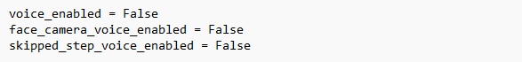

# **Troubleshooting**
Check out the following Troubletshooting FAQs to resolve your issue faster.
 
 

**1. Video feed is not showing when clicked START**
 
Solutions: 
a. Check if the camera's power is ON, and connected to the computer. 
b. Check to ensure the camera is on Standby mode (Red LED), instead of Booting up mode (blinking Green LED) 
c. Make sure the camera's address in the App.conf file is set correctly, matching the camera's address on its front display. 
d. To check the camera's connection to the computer, use the web brower to access the camera to ensure the camera's functionality. 
 

**2. Object is not detected**
 
Solutions: 
a. Make sure the object is not blocked from the camera angle. 
b. Check the zoom level of the zone, the zoom level may either need to increase or decrease. 
c. Reduce any extreme reflections off the object as this may affect the detection consistency.  
 

**3. Process step in the user interface is not moving**
 
Solutions: 
a. Ensure each process step's descriptions are within 1-row of the Process Guide box.  
Truncate the process step descriptions to contain within 1-row so that the steps are able to auto-scroll within the Proces Guide box's visible range. 
 

**4. Voice guide is not audible**
 
Solutions: 
a. Check that the Generate Voice setting for that process is set as "Y". 
b. Ensure the voice settings in the App.conf file is setting as desired, see below: 

Voice settings in App.conf  - example:
 

 
 

**5. Camera moves aimlessy**
 
Solutions: 
a. Check Process Step File, ensure PTZ zones set correctly under Deep-scan&reg;, name matches App.conf, zone name and number do not duplicate of another zone. 
b. If the above doesn't work, try install the latest "msvcp140.dll" file from Oremi, in case it is corrupted. 
 

**6. Barcode, QR code or OCR is not detected**
 
Solutions: 
a. Check to ensure the format is correctly set in the Process Step file, make sure the format matches the code read by Deep-scan&reg;. 
b. Make sure the zoom level in the PTZ zone is set sufficiently to have a close enought view. 
c. Reduce the reflections or glare of the code label. 
d. For multiple bar codes within a single camera zone view, let Deep-scan&reg; scan each barcode separately with 5-seconds delay between each label. 
 

**Further support** 
Contact our sales team for further help if the above FAQs do not solve the issue you are encountering. 
 